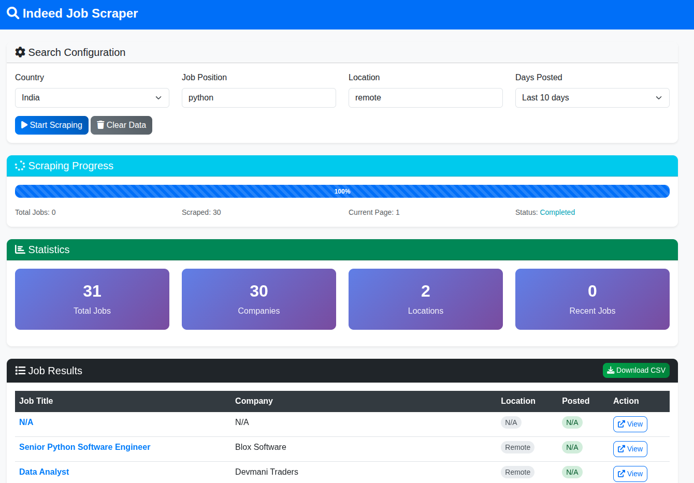

# 🔍 Indeed Job Scraper

> **A powerful and user-friendly tool to scrape job listings from Indeed.com across 30+ countries**

Find your dream job faster! This Python application helps you discover job opportunities from Indeed.com with a beautiful web interface. Whether you're looking for remote work, local positions, or exploring international opportunities, this scraper makes job hunting effortless and efficient.


*The clean and intuitive web interface makes job searching simple and efficient*

## ✨ What Makes This Special?

- 🌍 **Global Reach**: Search jobs in 30+ countries including US, UK, Canada, Germany, India, and more
- 💻 **Beautiful Web Interface**: Modern, responsive design that works on any device
- ⚡ **Real-time Progress**: Watch your scraping progress live with detailed statistics
- 📊 **Smart Analytics**: Get instant insights about job markets, top companies, and recent postings
- 📁 **Export Ready**: Download results as CSV files for further analysis
- 🚀 **Easy to Use**: Simple web interface - no technical knowledge required
- 🔄 **Background Processing**: Scraping runs in the background while you can do other things

## 🎯 Perfect For

- **Job Seekers**: Find opportunities that match your skills and location preferences
- **Recruiters**: Discover what companies are hiring and where
- **Market Researchers**: Analyze job trends and salary insights
- **Career Coaches**: Help clients explore job markets worldwide
- **Students**: Research career opportunities in different fields and locations

## 🚀 Quick Start

### Prerequisites

Before you begin, make sure you have:
- **Python 3.7 or higher** installed on your system
- **Google Chrome browser** installed (the scraper uses Chrome for web automation)

### Installation & Setup

1. **Clone the repository**:
   ```bash
   git clone https://github.com/your-username/AIO-Scrapper.git
   cd AIO-Scrapper
   ```

2. **Install required packages**:
   ```bash
   pip install -r requirements.txt
   ```

3. **Start the web application**:
   ```bash
   python run_web.py
   ```

4. **Open your browser** and navigate to: `http://localhost:5000`

### How to Use

1. **Select your search criteria**:
   - Choose a country from the dropdown menu
   - Enter your desired job title (e.g., "python developer", "data scientist", "marketing manager")
   - Specify the location (e.g., "remote", "New York", "London", "San Francisco")
   - Select how recent you want the jobs (last 24 hours, 3 days, 7 days, 10 days, or 30 days)

2. **Start scraping**:
   - Click the "Start Scraping" button
   - Watch the real-time progress bar and statistics
   - The scraper will automatically navigate through multiple pages of results

3. **View and download results**:
   - Browse through the job listings in the results table
   - Click on any job title to view it on Indeed.com
   - Download all results as a CSV file for further analysis

## 🌍 Supported Countries

| Country | Code | Country | Code |
|---------|------|---------|------|
| 🇺🇸 United States | `united_states` | 🇬🇧 United Kingdom | `united_kingdom` |
| 🇨🇦 Canada | `canada` | 🇩🇪 Germany | `germany` |
| 🇦🇺 Australia | `australia` | 🇮🇳 India | `india` |
| 🇫🇷 France | `france` | 🇯🇵 Japan | `japan` |
| 🇪🇸 Spain | `spain` | 🇰🇷 South Korea | `south_korea` |
| 🇮🇹 Italy | `italy` | 🇧🇷 Brazil | `brazil` |
| 🇳🇱 Netherlands | `netherlands` | 🇲🇽 Mexico | `mexico` |
| 🇸🇪 Sweden | `sweden` | 🇸🇬 Singapore | `singapore` |
| 🇨🇭 Switzerland | `switzerland` | 🇦🇪 UAE | `united_arab_emirates` |
| 🇳🇿 New Zealand | `new_zealand` | 🇿🇦 South Africa | `south_africa` |
| 🇳🇬 Nigeria | `nigeria` | 🇸🇦 Saudi Arabia | `saudi_arabia` |
| 🇪🇬 Egypt | `egypt` | 🇹🇭 Thailand | `thailand` |
| 🇻🇳 Vietnam | `vietnam` | 🇦🇷 Argentina | `argentina` |
| 🇮🇪 Ireland | `ireland` | 🇨🇳 China | `china` |

*And many more! Check the dropdown in the web interface for the complete list.*

## 📊 What You'll Get

### Real-Time Dashboard
- **Live Progress Bar**: See exactly how many jobs have been scraped in real-time
- **Smart Statistics**: Total jobs found, unique companies, different locations, and recent postings
- **Interactive Results**: Click on any job title to view the full job posting on Indeed.com
- **Export Options**: Download all your results as a CSV file for further analysis
- **Background Processing**: The scraper runs in the background, so you can do other things while it works

### Detailed Job Information
Each job listing includes:
- **Job Title**: The exact position name with clickable link to Indeed
- **Company**: The hiring company name
- **Location**: Where the job is based (city, state, country, or "Remote")
- **Posted Date**: How recent the posting is (e.g., "2 days ago", "1 week ago")
- **Direct Link**: Click to view the full job posting and apply on Indeed.com

### Sample Results
```
Job Title: Senior Python Developer
Company: TechCorp Inc.
Location: Remote
Posted: 2 days ago
Link: https://indeed.com/viewjob?jk=abc123...
```

### Statistics Dashboard
The web interface provides helpful statistics:
- **Total Jobs**: Number of jobs found and scraped
- **Unique Companies**: How many different companies are hiring
- **Locations**: Number of different locations where jobs are available
- **Recent Jobs**: Count of jobs posted recently (within the selected timeframe)

## 🛠️ Technical Requirements

**What you need to install:**
- [Python 3.7 or higher](https://www.python.org/downloads/)
- [Google Chrome browser](https://www.google.com/chrome/)

**That's it!** The scraper automatically handles ChromeDriver installation and setup using webdriver-manager.

## 📁 Project Structure

```
AIO-Scrapper/
├── app.py                 # Main Flask web application
├── job_scraper_utils.py   # Core scraping functions and utilities
├── run_web.py            # Easy launcher for the web application
├── requirements.txt      # Python dependencies
├── templates/            # HTML templates for the web interface
│   └── index.html       # Main web page with search form and results
├── static/              # Static web assets
│   ├── css/
│   │   └── style.css    # Custom CSS styling
│   ├── js/
│   │   └── app.js       # Frontend JavaScript functionality
│   └── downloads/       # Directory where CSV files are saved
├── scrapper-indeed.png  # Project screenshot/image
└── README.md            # This documentation file
```

### Key Files Explained

- **`app.py`**: The main Flask application that handles web requests, manages scraping sessions, and serves the web interface
- **`job_scraper_utils.py`**: Contains all the core scraping logic, webdriver configuration, and data processing functions
- **`run_web.py`**: A convenient launcher script that checks dependencies and starts the web server
- **`templates/index.html`**: The main web page with a beautiful, responsive interface for job searching
- **`static/js/app.js`**: Handles real-time progress updates, form submission, and dynamic content loading
- **`static/css/style.css`**: Custom styling that makes the interface modern and user-friendly

## 🔧 Advanced Features

### Smart Search Capabilities
- **Flexible Job Titles**: Use specific terms like "senior python developer", "data scientist remote", "marketing manager", or general terms like "developer"
- **Location Flexibility**: Try "remote", "New York, NY", "London, UK", or be more specific with city names
- **Date Range Options**: Choose from 1 day to 30 days for job recency to find the freshest opportunities
- **Multi-page Scraping**: Automatically navigates through multiple pages of results to get comprehensive data

### Web Interface Features
- **Real-time Progress**: Watch live updates as jobs are being scraped
- **Interactive Results**: Click on any job title to view the full posting on Indeed.com
- **CSV Export**: Download all results in a spreadsheet format for further analysis
- **Statistics Dashboard**: Get insights about the job market with detailed statistics
- **Responsive Design**: Works perfectly on desktop, tablet, and mobile devices

### Technical Features
- **Headless Browser**: Runs Chrome in the background without opening a visible window
- **Stealth Mode**: Uses selenium-stealth to avoid detection and blocking
- **Error Handling**: Robust error handling with user-friendly error messages
- **Background Processing**: Scraping runs in separate threads so the web interface remains responsive

## 🚨 Important Notes

### Responsible Usage
- ✅ This tool is designed for personal job searching and research purposes
- ✅ We respect Indeed's servers with reasonable request rates and delays
- ✅ Always follow Indeed's Terms of Service and robots.txt guidelines
- ❌ Don't use for commercial scraping without proper authorization
- ❌ Don't overload Indeed's servers with excessive requests

### Troubleshooting

**No results found?**
- Try different keywords (e.g., "software engineer" instead of "developer")
- Check if you're using English keywords for non-English countries
- Try broader location terms (e.g., "United States" instead of specific cities)
- Make sure your internet connection is stable
- Verify that Chrome browser is installed and up to date

**Web interface not loading?**
- Make sure you're running `python run_web.py` from the correct directory
- Check if port 5000 is available on your computer
- Try refreshing your browser or clearing cache
- Ensure all dependencies are installed: `pip install -r requirements.txt`

**Scraping stops unexpectedly?**
- Check your internet connection
- Verify that Indeed.com is accessible from your location
- Try with a different country or job search terms
- Make sure Chrome browser is not being blocked by antivirus software

## 🔮 Future Roadmap

### Planned Enhancements
- **🔗 LinkedIn Integration**: Add support for scraping LinkedIn job postings
- **🏢 Glassdoor Support**: Include company reviews and salary insights
- **📊 Advanced Analytics**: Job market trends, salary analysis, and skill demand insights
- **🔔 Job Alerts**: Email notifications for new matching jobs
- **📱 Mobile App**: Native mobile application for on-the-go job searching
- **💾 Database Storage**: Store job history and search preferences
- **🎯 Smart Filtering**: Advanced filters for salary range, company size, job type
- **📈 Market Insights**: Detailed analytics about job market trends and patterns

### Potential Features
- **Multi-Platform Search**: Search across multiple job platforms simultaneously
- **AI-Powered Matching**: Smart job recommendations based on your profile and preferences
- **Company Research**: Detailed company information and culture insights
- **Application Tracking**: Track your job applications and follow-ups
- **Resume Integration**: Match your resume against job requirements

## 🤝 Contributing

Found a bug or want to add a feature? We'd love your help!

1. **Fork the repository** on GitHub
2. **Create a feature branch**: `git checkout -b amazing-feature`
3. **Make your changes** and test them thoroughly
4. **Commit your changes**: `git commit -m 'Add amazing feature'`
5. **Push to the branch**: `git push origin amazing-feature`
6. **Open a Pull Request** with a clear description of your changes

### Priority Contributions
- **LinkedIn Scraper**: Help us add LinkedIn job scraping functionality
- **New Job Platforms**: Add support for other job sites (Glassdoor, ZipRecruiter, etc.)
- **UI/UX Improvements**: Make the interface even more user-friendly and responsive
- **Performance Optimization**: Speed up scraping and reduce resource usage
- **Bug Fixes**: Help us identify and fix any issues
- **Documentation**: Improve documentation and add more examples

## 📄 License

This project is open source and available under the [MIT License](LICENSE).

## 🙏 Acknowledgments

- Built with [Selenium](https://selenium-python.readthedocs.io/) for web automation
- Powered by [Flask](https://flask.palletsprojects.com/) for the web interface
- Styled with [Bootstrap](https://getbootstrap.com/) for beautiful, responsive UI
- Data processing with [Pandas](https://pandas.pydata.org/) for easy analysis
- Enhanced with [selenium-stealth](https://github.com/diprajpatra/selenium-stealth) for better scraping reliability
- Icons provided by [Font Awesome](https://fontawesome.com/)

---

**Happy job hunting! 🎉**

*This Indeed Job Scraper is designed to make your job search easier and more efficient. If this tool helped you find your dream job, we'd love to hear about it! Consider giving this project a ⭐ on GitHub and sharing it with other job seekers.*
